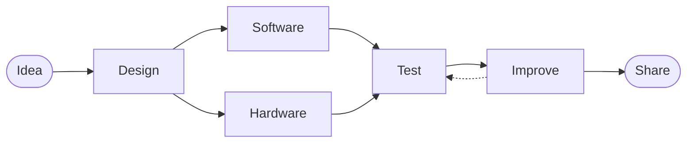

<div align="center">


<br>

<a href="https://github.com/ertyu007">
  
</a>
<a href="https://github.com/ertyu007?tab=repositories">
  
</a>

</div>

<br>

## 👋 About

```ts
const ertyu007 = {
  focus: [
    "Web Development",
    "Artificial Intelligence",
    "Computer Vision",
    "IoT & Embedded Systems",
    "Networking",
  ],
  philosophy: "Build things that solve real problems.",
  workflow: "Idea → Prototype → Test → Improve → Share",
};
```

I enjoy working at the boundary between **software and hardware** — taking an idea, building a prototype, wiring the components together, and turning it into something people can actually use.

<br>

## 🛠️ What I Build

<table>
<tr>
<td width="50%" valign="top">

### 💻 Software
Web apps, interactive systems, games, dashboards and developer tools.

`HTML` `CSS` `JavaScript` `TypeScript`
`React` `Vite` `Tailwind` `PHP` `MySQL`

</td>
<td width="50%" valign="top">

### 👁️ AI / Computer Vision
Computer vision experiments and practical AI systems.

`Python` `OpenCV` `YOLO` `MediaPipe`
`Face Recognition` `Image Processing`

</td>
</tr>
<tr>
<td width="50%" valign="top">

### 🔌 IoT / Embedded
Hardware prototypes connecting sensors, controllers and software.

`ESP32` `Arduino` `Micro:bit`
`Sensors` `Relay` `MQTT` `Telegram Bot`

</td>
<td width="50%" valign="top">

### 🌐 Networking
Hands-on network infrastructure and troubleshooting.

`LAN` `RJ45` `Access Point`
`Network Design` `UDP` `Network Testing`

</td>
</tr>
</table>

<br>

## 🚀 Featured Projects

| Project | Description | Focus |
| :-- | :-- | :-- |
| **SkillProof AI** | AI-powered platform that helps people prove what they can do through projects, evidence and practical skills. | `AI` `Web` `Portfolio` |
| **Smart Farm / IoT** | Connected hardware for real-world problems: soil monitoring, environmental sensing and automatic control. | `ESP32` `IoT` `Automation` |
| **Computer Vision** | Image processing, object detection, face recognition and automated visual analysis. | `Python` `OpenCV` `YOLO` |
| **Math Match Ultimate** | Browser-based educational game with difficulty modes, rewards, achievements, themes and progression. | `JavaScript` `Gamification` |
| **Portfolio** | A continuously evolving space for showcasing projects, experiments and development work. | `Web` `UI` `Animation` |

<br>

## ⚡ Tech Stack

<div align="center">


<br>


<br><br>

`ESP32` · `Arduino` · `Micro:bit` · `MQTT` · `UDP`

</div>

<br>

## 🎯 Currently

| 🔨 Building | 📚 Learning | 🔭 Exploring |
| :-- | :-- | :-- |
| AI & Computer Vision projects | Computer Engineering | Edge AI |
| IoT / ESP32 prototypes | Network Systems | Smart Agriculture |
| Web applications | AI / Machine Learning | Automation |
| Open-source experiments | Software Architecture | AI-powered developer tools |

<br>

## 🧠 Engineering Mindset

I don't just want to write code — I want to understand how the **whole system** works.



The interesting part is usually **connecting everything together**.

<br>

## 📊 GitHub Stats

<div align="center">


</div>

<br>

<div align="center">

<a href="https://github.com/ertyu007">
  
</a>
<a href="https://github.com/ertyu007?tab=repositories">
  
</a>

<br><br>

**Build → Break → Learn → Build again.**


</div>
