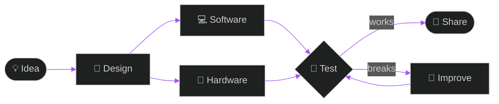

<div align="center">


<br>


<br><br>


</div>

<br>

<div align="center">

### ⚡ FOCUS


<br><br>

```diff
+ Build things that solve real problems.
```

</div>

<br>

## 🧬 How I work



<br>

## 🛠️ Arsenal

<div align="center">


<br>

<br><br>


</div>

<br>

## 🚀 Projects

<table>
<tr>
<td width="50%" valign="top">

<h3>🧩 SkillProof AI</h3>

AI platform for proving real skills through projects and evidence.


</td>
<td width="50%" valign="top">

<h3>🌱 Smart Farm</h3>

ESP32 soil and environment monitoring with automatic control.


</td>
</tr>
<tr>
<td width="50%" valign="top">

<h3>🎯 Computer Vision Lab</h3>

Object detection, face recognition and visual analysis experiments.


</td>
<td width="50%" valign="top">

<h3>🎮 Math Match Ultimate</h3>

Browser learning game with achievements, themes and progression.


</td>
</tr>
</table>

<br>

## 📊 Stats

<div align="center">


</div>

<br>

## 🎯 Now

<details open>
<summary><b>🔨 Building</b></summary>
<br>

`AI & vision projects` `ESP32 prototypes` `Web applications` `Open-source experiments`

</details>

<details>
<summary><b>📚 Learning</b></summary>
<br>

`Computer engineering` `Network systems` `Machine learning` `Software architecture`

</details>

<details>
<summary><b>🔭 Exploring</b></summary>
<br>

`Edge AI` `Smart agriculture` `Automation` `AI developer tools`

</details>

<br>

<div align="center">

<a href="https://github.com/ertyu007?tab=repositories">
  
</a>

<br><br>


</div>
