I like projects where code touches something physical: a webcam, a microphone, a sensor, a video frame. Most of what's below started as "can I even make this work?" and got rewritten at least once.

Right now my time goes into three things: a Manim framework for vertical Thai explainer animations, tools that turn body movement and voice into computer input, and ESP32 hardware.

<br>

## Things I've built

### Animetion Studio v6

A custom framework on top of [Manim](https://www.manim.community/) for making vertical, phone-shaped educational animations in Thai.

- Scenes are timed with a `beat()` helper
- Thai font rendering and portrait layouts were the real fight: glyphs breaking, and horizontal layouts spilling out of a phone-width frame
- Episodes so far: Ctrl+Z / Ctrl+Y explained as two stacks (`undo_redo_stack.py`), and OOP told through a game-character factory
- Voiceover with free Thai TTS: `edge-tts`, voice `th-TH-PremwadeeNeural`

`Python` `Manim` `edge-tts` `CapCut`

<br>

### Exercise → Game Input

Do the exercise, the game gets the keypress.

MediaPipe Pose reads the webcam and turns sit-ups, arm curls and running in place into keyboard input, with an on-screen overlay. Built to pair with browser games and Roblox.

`Python` `MediaPipe Pose` `OpenCV`

<br>

### Thai Voice Command App

Say a wake word in Thai, then say what to open. Windows launches the program or website.

Two stages: wake word first, command second, built on `speech_recognition`.

`Python` `speech_recognition` `Windows`

<br>

### Daily Script Generator

A content workflow for publishing about 30 clips a month.

The first plan was big: Make.com, Gemini through AI Studio, LINE Messaging API alerts, PartyRock for scripts and covers. I kept the simple version, a single-widget generator, because the one I'd actually use every day beats the one that's impressive on a diagram.

The planning side is a matrix:

```text
6 topic pillars  ×  5 storytelling formats  =  30 clips
```

`Make.com` `Gemini API` `LINE API` `PartyRock`

<br>

### Hardware

ESP32, Arduino and Micro:bit prototypes: soil and environment monitoring, automatic control, remote access over MQTT, Telegram bot alerts. Also LAN layouts and access point installs.

`ESP32` `Arduino` `Micro:bit` `MQTT` `Networking`

<br>

Also around: **SkillProof AI** (a platform for proving skills through real projects) and **Math Match Ultimate** (a browser learning game with achievements and themes).

<br>

## Lately

- A 10-clip series on Transformer architecture, around 5 seconds each, with scripts, voiceover and text overlays planned per clip
- Windows repair commands as short-form material: `taskkill`, `sfc /scannow`, `DISM`

<br>

## How I work

1. Get the ugly version running first.
2. Pick the thing I'll actually use over the thing that looks clever.
3. Rewrite after it breaks.

<br>

## Toolbox


<br>

<sub>More in [repositories](https://github.com/ertyu007?tab=repositories).</sub>
